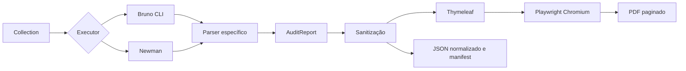

# GeradorDocsTests 3.0.0

CLI Java 25 que executa collections **Bruno e Postman/Newman** e gera uma evidência corporativa em PDF. O mesmo domínio, sanitizador e template atendem ambos os runners. Uma assertion falha mantém a evidência e retorna código 1 para o pipeline, mesmo quando o HTTP é 200/201.



## Capacidades

- Detecção de collection, ambientes externos, folders/iterações e argumentos adicionais.
- Requests, responses, headers, assertions e erros no PDF; JSON formatado, textos preservados.
- HTTP 201 + assertion esperando 200 = **FAIL**. Assertions skipped são não aprovadas.
- Mascaramento recursivo e configurável; resultados brutos temporários removidos em `finally`.
- Identidade visual azul-marinho, badges por método/status, metadados, rastreabilidade e “Página X de Y”.
- Usuário do SO, Git CLEAN/DIRTY, commit e contexto Azure DevOps/GitHub/GitLab/Jenkins.
- Bootstrap básico de OpenAPI 3 JSON/YAML para Bruno/Postman, sem inventar testes de negócio.
- Manifests em arquivos e comparação de regressões, recuperação e tempo de resposta.

## Instalação e build

Requisitos: Java **25**, Maven **3.8.7+**, Node **22**, Bruno CLI **4.0.0** e/ou Newman **6.2.2**, Chromium correspondente ao Playwright Java **1.40.0**.

```bash
npm install -g @usebruno/cli@4.0.0 newman@6.2.2
mvn clean test
mvn package
java -cp target/gerador-docs-tests-3.0.0.jar com.microsoft.playwright.CLI install chromium
java -jar target/gerador-docs-tests-3.0.0.jar --help
```

Em agentes Linux limpos, a instalação das bibliotecas nativas pode exigir administrador: `java -cp target/gerador-docs-tests-3.0.0.jar com.microsoft.playwright.CLI install --with-deps chromium`. Consulte [instalação](docs/INSTALLATION.md).

## Uso

Bruno:

```bash
java -jar target/gerador-docs-tests-3.0.0.jar \
  --collection ./examples/bruno-pass --environment HML --company "MINHA_EMPRESA"
```

Postman:

```bash
java -jar target/gerador-docs-tests-3.0.0.jar \
  --collection ./examples/pass.postman_collection.json \
  --environment HML --environment-file /caminho/hml.postman_environment.json
```

`--environment` é o rótulo da evidência. Para selecionar o ambiente Bruno, use também `--bruno-env HML`; para carregar um arquivo em qualquer runner, `--environment-file PATH`. Auth, variáveis, scripts e redirects pertencem ao runner.

```bash
java -jar target/gerador-docs-tests-3.0.0.jar --collection /caminho/collection \
  --config examples/audit.properties --mask-key cpf --mask-key accountNumber
```

Saídas em `audit-output/` por padrão:

- `auditoria_api_<collection>_<environment>_<timestamp>_<PASS|FAIL>.pdf`
- Mesmo prefixo + `.sanitized.json`: domínio sanitizado completo.
- Mesmo prefixo + `.audit-run.json`: resumo/histórico sem payloads.

Os nomes usam milissegundos; saídas existentes não são sobrescritas. `--pdf-output` e `--json-output` aceitam caminhos explícitos. O JSON deste último é **sanitizado**, nunca o reporter bruto.

| Código | Significado |
|---|---|
| 0 | Execução aprovada e artefatos gerados; ou comando auxiliar concluído |
| 1 | Testes falharam; PDF e manifests gerados |
| 2 | Erro técnico/configuração; não há garantia de PDF |

## Segurança

Não publique JSON bruto. Por padrão ele fica em diretório temporário privado e é removido ao terminar, inclusive em falhas. `--keep-raw-results` conserva uma cópia `.raw.json` e emite aviso. O PDF/JSON sanitizado não constitui garantia de anonimização universal: texto livre, binário e dados pessoais exigem revisão e chaves adicionais. Os logs livres dos runners são suprimidos, pois scripts podem imprimir segredos. Consulte [política e limitações](docs/SECURITY.md).

## Documentação

[Arquitetura](docs/ARCHITECTURE.md) · [Instalação](docs/INSTALLATION.md) · [Uso](docs/USAGE.md) · [Configuração](docs/CONFIGURATION.md) · [Bruno](docs/BRUNO.md) · [Postman/Newman](docs/POSTMAN_NEWMAN.md) · [Segurança](docs/SECURITY.md) · [Relatório](docs/REPORT.md) · [CI/CD](docs/CI_CD.md) · [OpenAPI](docs/OPENAPI.md) · [Troubleshooting](docs/TROUBLESHOOTING.md) · [Roadmap](docs/ROADMAP.md) · [Desenvolvimento](docs/DEVELOPMENT.md) · [Changelog](CHANGELOG.md).

Relatório desta entrega: [validação e limitações](docs/VALIDATION.md).

## Licença e uso pela empresa

O código original e a documentação do GeradorDocsTests são software livre e de código aberto, disponibilizados sob a **[licença MIT](LICENSE)**. É permitido usar gratuitamente em empresas, inclusive comercialmente, copiar, modificar, integrar a sistemas proprietários e redistribuir. A MIT não exige publicar as alterações internas da empresa.

Ao copiar ou redistribuir o software ou partes substanciais dele, mantenha o aviso de copyright e o texto da licença. O software é fornecido sem garantia, conforme o texto integral da MIT. Referência: [licença MIT na Open Source Initiative](https://opensource.org/license/mit).

Esta licença se aplica ao código original do projeto; bibliotecas, runners, navegador e outros componentes de terceiros mantêm suas próprias licenças e avisos. O JAR inclui dependências: sua redistribuição também deve respeitar essas condições. A inclusão da MIT não representa uma auditoria das licenças de terceiros.

A disponibilização sob MIT pressupõe que os titulares dos direitos autorais autorizem essa licença. Se algum trecho pertencer a um empregador, cliente ou terceiro, a autorização correspondente precisa existir. O uso na empresa continua sujeito às políticas internas de aprovação de software.
